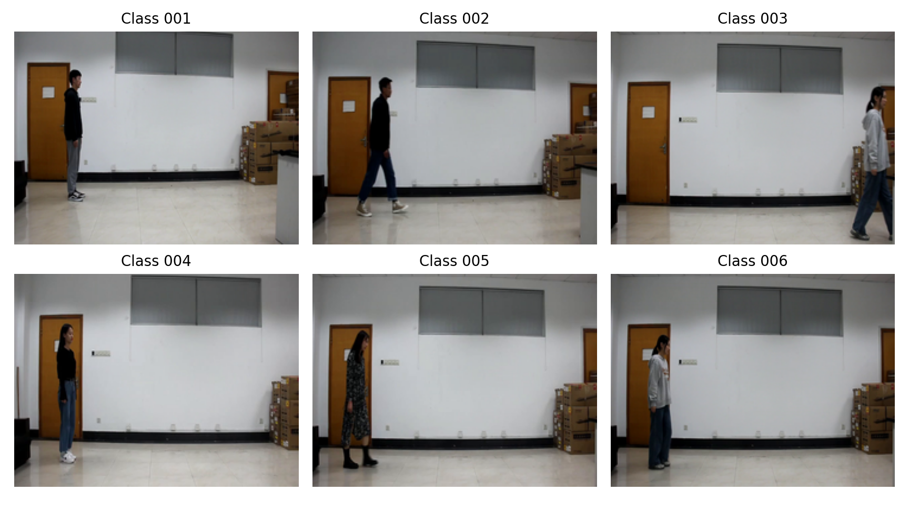
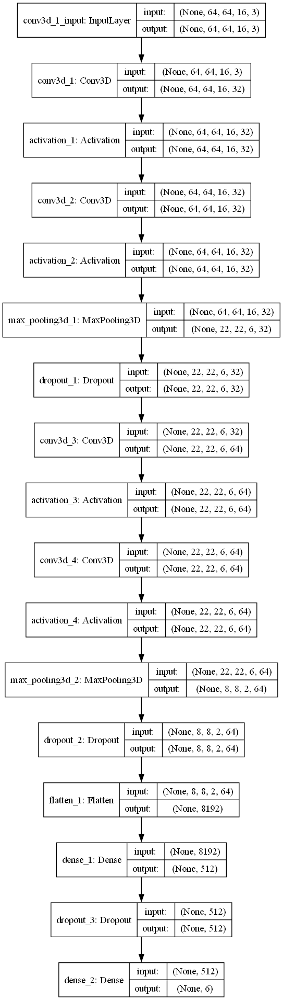
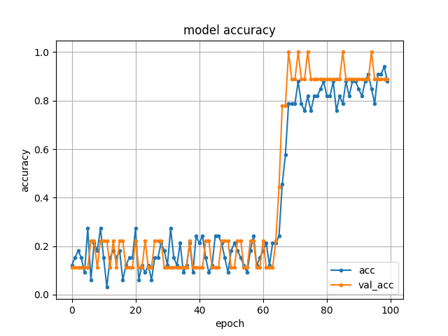
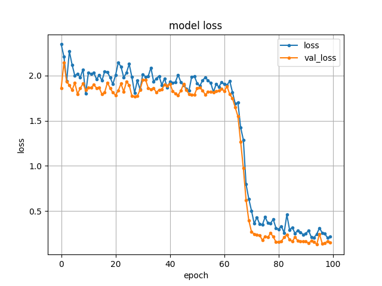

# Easy CNN for Gait Recognition

A small learning project for trying 3D CNN-based gait recognition on short walking videos. This repository is meant for coursework-style exploration and personal CV display, not for biometric deployment, security verification, or real-world recognition.

The current experiment only fits a closed toy setting: 6 identities (`001` to `006`) recorded in 6 main video conditions, with one extra take per identity in the local folder. I checked the source directory: it contains 42 private clips in total, 7 clips for each identity. Raw videos are not published; the repository only includes screenshots, architecture figures, curves, and source code.



## Scope

- Entertainment and learning only: a compact 3D CNN baseline for understanding video classification.
- Closed-set assumption: labels are known identities from the same tiny 6-person collection.
- Private data policy: videos, tensor caches, and trained weights are excluded from the public repository.
- Public artifacts: still-frame screenshots, network architecture, training curves, and the result log.
- Clear code structure: source code, scripts, documentation, and generated outputs are separated.

## Network Architecture

The baseline keeps the original lightweight 3D CNN topology while updating the implementation to modern TensorFlow Keras APIs.



| Stage | Layer | Output intent |
| --- | --- | --- |
| Input | 16 RGB frames, 64 x 64 | Fixed-length gait clip tensor |
| Block 1 | Conv3D 32 -> activation -> Conv3D 32 -> pooling -> dropout | Low-level spatiotemporal motion features |
| Block 2 | Conv3D 64 -> activation -> Conv3D 64 -> pooling -> dropout | Higher-level gait dynamics |
| Head | Flatten -> Dense 512 -> dropout -> Dense softmax | Class probability over subject IDs |

## Runtime Outputs

The repository includes the original six-class demo run outputs under `docs/`.

| Metric | Value |
| --- | --- |
| Identities | 6 |
| Main recording conditions | 6 |
| Private clips checked locally | 42 total, 7 per identity |
| Split | 80 percent train / 20 percent validation |
| Epochs | 100 |
| Final validation accuracy | 88.89 percent |
| Peak validation accuracy | 100.00 percent |

The dataset is intentionally tiny. These numbers only show that the code path works under the private six-person toy condition; they should not be reported as a general gait-recognition benchmark.

| Accuracy | Loss |
| --- | --- |
|  |  |

The full result log is available at [`docs/results/result_3dcnn_6class.tsv`](docs/results/result_3dcnn_6class.tsv).

## Quick Start

```powershell
python -m venv .venv
.\.venv\Scripts\Activate.ps1
pip install -r requirements.txt
python scripts/train.py --videos data/private --epochs 3 --batch-size 2 --test-size 0.5 --output outputs/sample_run
```

Place private videos under `data/private/`, or point `--videos` to another local directory that follows the same naming convention:

```powershell
python scripts/train.py --videos path\to\gait_videos --epochs 100 --batch-size 4 --class-limit 6 --output outputs/3dcnn_6class
```

Training writes the following generated artifacts to the output folder:

- `classes.txt`
- `model.png`
- `model_accuracy.png`
- `model_loss.png`
- `result.tsv`
- `easy_gait_3dcnn.json`
- `easy_gait_3dcnn.weights.h5`

Generated weights, tensor caches, and run folders are ignored by Git to keep the public repository lightweight.

## Dataset Format

Videos are grouped by the prefix before the first hyphen:

```text
001-01-1.mp4 -> class 001
002-03-1.mp4 -> class 002
006-06-3.mp4 -> class 006
```

Supported video extensions are `.mp4`, `.avi`, `.mov`, and `.mkv`. Each clip is sampled to a fixed depth, resized, normalized to `[0, 1]`, and fed into the model as `(frames, height, width, channels)`.

## Repository Layout

```text
.
|-- data/                        # Private videos are kept out of Git
|-- docs/figures/                # Architecture, runtime screenshots, and curves
|-- docs/results/                # Six-class demo result log
|-- scripts/
|   |-- make_sample_grid.py      # Builds README sample-frame visualization
|   `-- train.py                 # Training entry point
|-- src/easy_gait_cnn/
|   |-- model.py                 # 3D CNN architecture
|   `-- video.py                 # Video loading and label parsing
|-- requirements.txt
`-- README.md
```

## Notes

This repository is a cleaned public version of a compact gait-recognition experiment. It is suitable for demonstrating the workflow and baseline implementation, but the current model is only meaningful under the original six-person, small-sample condition. Robust research or deployment would require a larger dataset, cross-view evaluation, stronger temporal backbones, and privacy-aware data handling.
